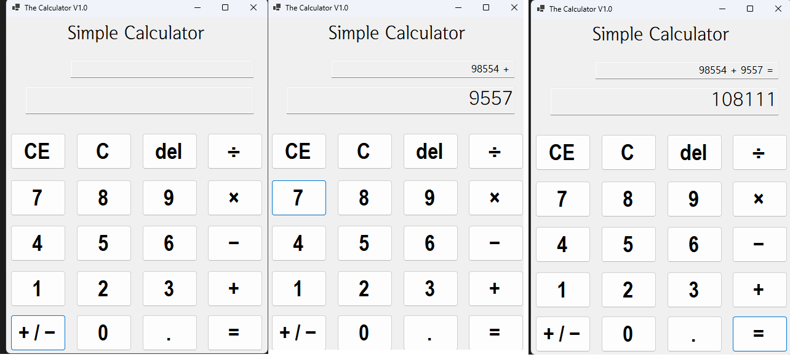
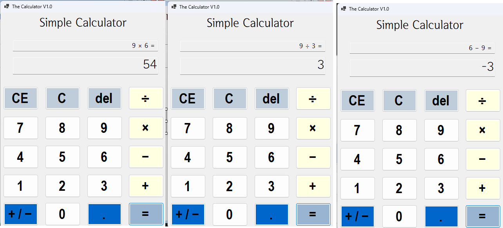
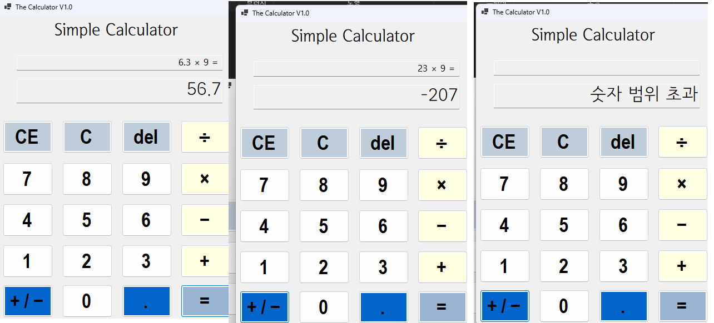
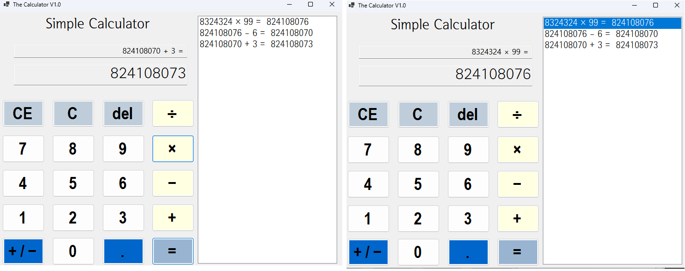

# (C# 코딩) 심플 계산기
## 개요
- C# 프로그래밍 학습
- 1줄 소개: 간단한 사칙연산이 가능한 계산기
- 사용한 플랫폼:
  - C#, .NET Windows Forms, Visual Studio, GitHub
- 사용한 컨트롤:
  - Label, TextBox, Button, Listbox
- 사용한 기술과 구현한 기능:
  - Visual Studio를 이용하여 UI 디자인
  - Parse를 통한 decimal(double) < - > string 변환
  - catch(오류명)을 통한 버그 대응
  - if 조건문을 통한 버그 대응 및 금지
  - keydown 이벤트 활용을 통한 키보드 입력 대응
  - public class를 활용한 기록 저장

## 실행 화면 (과제1)
- 과제1 코드의 실행 스크린샷

- 과제 내용
	- 계산기 기본 UI 디자인 (버튼 및 기타 기능)
    - 덧셈기능 구현
    - 윈도우 계산기스러운 계산과정 디자인
    - 오버플로우 방지를 위한 글자 제한 및 e단위 치환
- 구현 내용과 기능 설명
  	- 버튼 0~9를 누르는 과정에서 모든 숫자를 일일이 넣으면 코드의 효율성이 떨어지므로 각 버튼의 텍스트 내용 숫자를 Parse하여 string, int 단위를 왔다갔다 가능하게 함
    - Maxlength 속성을 이용하여 인풋 최대치를 제한하고 ToString("g10")을 이용하여 계산 후 내용이 범위를 초과하면 e단위로 치환 (스택오버플로우 버그 미리 방지하기)
    - 더 큰 범위를 이용할 수 있도록 int가 아닌 double로 환경변수를 설정함
    - 윈도우 계산기스러운 모션을 위하여 isNewInput, isResultDisplayed 환경변수를 정의하여 결과가 나와있는 상태인지, = 연산자를 누른 직후 새 입력을 받는 상태인지 체킹함

- ## 실행 화면 (과제2)
- 과제2 코드의 실행 스크린샷

- 과제 내용
    - 곱하기/나누기/빼기 기능 추가
    - 0으로 못나누게 함
- 구현 내용과 기능 설명
    - HistoryTxt.Text = num1.ToString("g10") + " (연산자) "; 형식으로 통일하여 사칙연산을 구현하였음
    - 나누기에서 num2 연산자가 0일 경우 "0으로 나눌 수 없음"을 표시함

- ## 실행 화면 (과제3)
- 과제3 코드의 실행 스크린샷

- 과제 내용
    - 과한 스택오버플로우 요소 추가 차단
    - 소숫점 및 e단위 유연성 확대
    - C, CE, DEL, 양/음전환, 소숫점 기능 추가
- 구현 내용과 기능 설명
    - double > decimal 로 추가 수정하여 소숫점 및 e단위 표현이 좀 더 유연하게 함
    - catch (OverflowException) 발생 시 "숫자 범위 초과" 텍스트 출력 이벤트를 제작하여 프로그램 튕김 현상 사전 차단
    - if로 소숫점이 0개일 때만 입력이 가능하게 하여 x.x.x 형식을 사전 차단함
    - C, CE, DEL도 환경변수(num1, isnewinput 등) 를 보정하여 구현함

- ## 실행 화면 (과제4)
- 과제4 코드의 실행 스크린샷

- 과제 내용
    - 히스토리 기능 추가로 계산 기록을 쉽게 볼 수 있게 함
    - 리스트텍스트박스의 계산 기록을 클릭하면 클릭한 계산 기록으로 롤백이 가능함
    - 키보드 키바인딩 추가 (윈도우 기능대로)
- 구현 내용과 기능 설명
    - e단위가 num1에 그대로 삽입되면 숫자 단위가 아니라 팅기는 현상이 있어 보이는 변수는 g10으로 하되, rawinput 변수를 새로 만들어서 실제 계산은 원 숫자 그대로 되게 함
    - keydown이벤트를 폼 자체에 삽입하여 각 keycode를 윈도우 계산기와 같은 단축키 삽입으로 키보드로 계산기 이용이 가능
    - 각 계산 내용을 public class에 저장하여 history를 제작하고 리스트 안 계산 내역을 클릭하면 num1과 result에 대입한다.